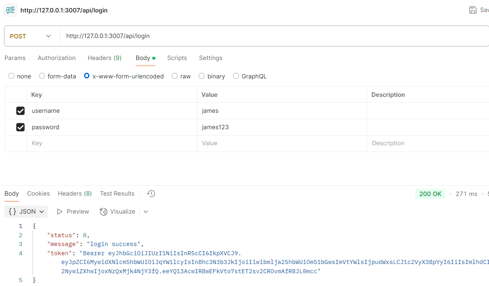

# Simple Node.js Application

This is a simple Node.js application that includes various user-related features. The features include:

## Features

### User Registration
Users can register for an account by providing their name, email, and password.

### User Login
Registered users can log in with their email and password.

### Get User Info
Users can retrieve their profile information.

### Update User Info
Users can update their profile information such as name, email, and password.

## Installation

1. Clone the repository:
   ```bash
   git clone https://github.com/yourusername/your-repo.git
   ```

2. Navigate to the project directory:
   ```bash
   cd your-repo
   ```

3. Install dependencies:
   ```bash
   npm install
   ```

4. Copy the example environment file and make the necessary configuration changes:
   ```bash
   cp .env.example .env
   ```

5. Start the application:
   ```bash
   npm start
   ```

## Screenshot
Register account


Login


Get Info


Update Info


## Contributing

Feel free to submit issues or pull requests if you would like to contribute to this project.

## License

This project is open-source and available under the [MIT License](LICENSE).
